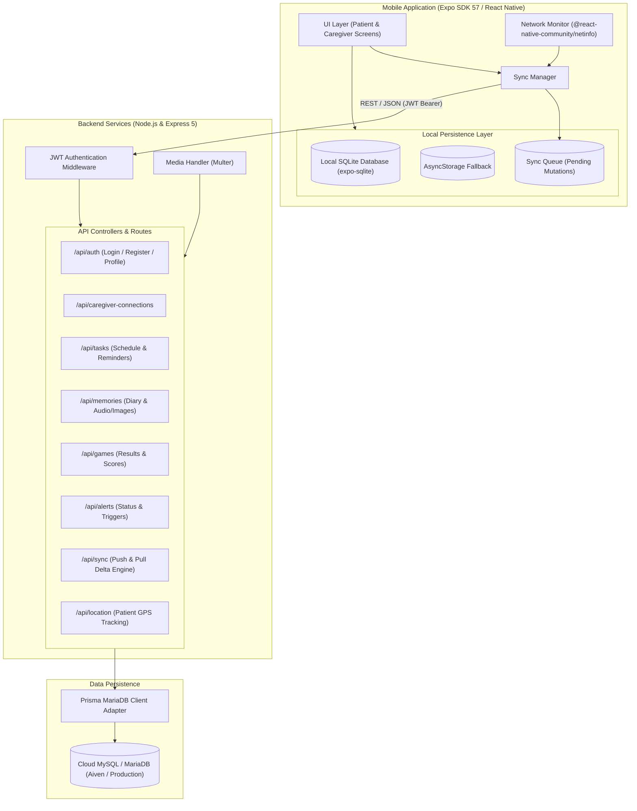
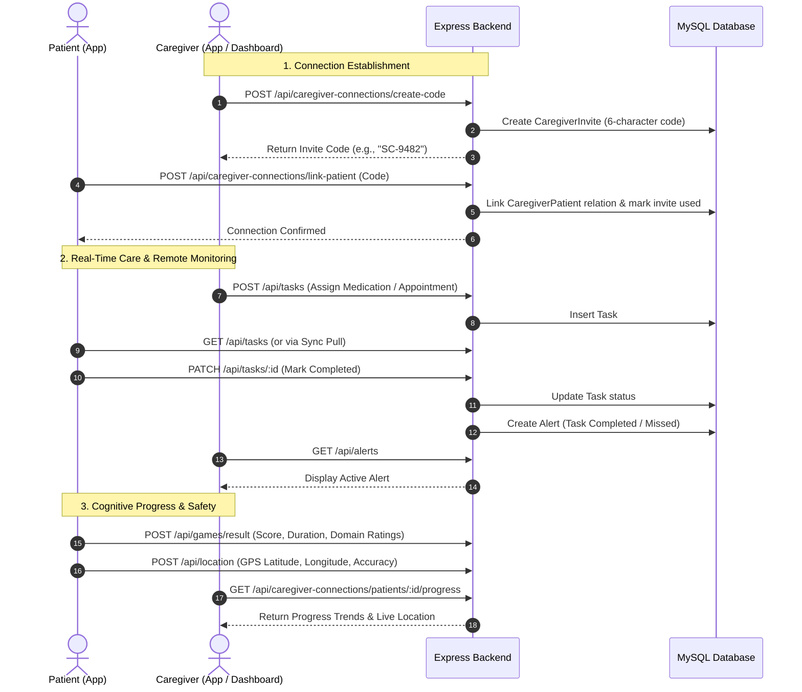

# 🧠 SmritiCare

[](https://docs.expo.dev/versions/v57.0.0/)
[](https://reactnative.dev/)
[](https://www.typescriptlang.org/)
[](https://expressjs.com/)
[](https://www.prisma.io/)
[](https://www.mysql.com/)

**SmritiCare** is a mobile cognitive-care and memory-support platform engineered to support individuals experiencing cognitive decline, dementia, or Alzheimer's disease, alongside their family members and professional caregivers. Built with an **offline-first** architecture, culturally resonant cognitive stimulation games, voice assistance, emergency distress triggers, and synchronized caregiver monitoring, SmritiCare ensures continuous care continuity even in remote and low-connectivity environments.

---

## 🏗️ System Architecture



---

## 🌟 Core Features

### 👤 Patient Experience & Assistance
- **Cultural & Cognitive Stimulation**: 10 interactive cognitive games targeting working memory, semantic association, visual discrimination, and auditory recognition.
- **Memory Diary ("Smriti Path")**: Multi-modal memory log supporting text notes, image attachments, and voice recordings.
- **Daily Schedule & Medication Reminders**: Visual and audio-enabled schedule tracking tasks, doctor appointments, hydration, and medications.
- **Voice Assistant**: Speech-recognition-powered voice assistant for hands-free navigation and memory queries.
- **One-Touch Emergency Assistance ("Medical Help")**: Instant SOS dispatcher triggering local alarms, notifying designated caregivers, and dialing emergency contacts.
- **Family Speed Dial**: Simplified photo-driven dialer allowing quick contact with loved ones.
- **Cognitive Scoreboard**: Transparent, non-stressful visualization of cognitive metrics, accuracy, and engagement streaks.
- **Accessibility Customization**: Configurable high-contrast text sizing and localized English/regional language preferences.

### 🛡️ Caregiver Oversight & Coordination
- **Caregiver Dashboard**: Real-time snapshot of patient activity, upcoming tasks, cognitive game scores, and battery status.
- **Secure Code Connection**: Link patients and caregivers via secure, single-use 6-character invitation codes (`CaregiverInvite`).
- **Remote Task Management**: Caregivers can assign, schedule, modify, or verify patient medication and daily care routines.
- **Proactive Alerts & Health Monitoring**: Automatic alerts for missed tasks, low patient device battery, and emergency calls.
- **GPS Location Tracking**: Real-time GPS location sharing and accuracy monitoring for patient safety.
- **Progress Analytics**: Longitudinal cognitive charts tracking memory, attention, reaction time, and play frequency.

### 📴 Offline-First Resilience
- **Dual-Layer Local Database**: Embedded `expo-sqlite` engine with seamless fallback to `AsyncStorage` when running in virtualized or sandbox environments.
- **Zero-Drop Offline Mutation Queue**: All games played, tasks created, and profile edits made offline are recorded in a local SQLite `sync_queue`.
- **Automatic Reconnection Sync**: Network status listener automatically triggers bidirectional sync (`/api/sync/push` and `/api/sync/pull`) when connectivity is restored.

---

## 🧠 Cognitive Games

SmritiCare features 10 cognitive stimulation games tailored with familiar cultural contexts (food, festivals, traditional attire) to reduce anxiety and promote recall in geriatric and memory-care patients.

| Game | Cognitive Domain | Mechanic & Gameplay | Status |
| :--- | :--- | :--- | :--- |
| **Guess the Food** | Semantic Memory & Cultural Recall | Identify popular traditional dishes from visual clues with hint support and multi-level difficulty. | `Available` |
| **Traditional Dress Match** | Pattern Matching & Cultural Association | Connect regional attires and textile patterns to their cultural origins. | `Available` |
| **Festival Memory** | Episodic Memory & Recognition | Match festive celebration elements, symbols, and artifacts. | `Available` |
| **What Belongs Together?** | Conceptual & Category Association | Group related everyday objects and contextual pairs (e.g., lock & key, tea & cup). | `Available` |
| **Spot the Difference** | Visual Discrimination & Attention | Find subtle visual differences between two side-by-side scenes under adaptive time limits. | `Available` |
| **Odd One Out** | Analytical Reasoning & Categorization | Identify the anomalous object from a grid of categorical items. | `Available` |
| **Color Sequence** | Working Memory & Sequential Processing | Memorize and reproduce expanding color and pattern flash sequences. | `Available` |
| **Sound Games** | Auditory Discrimination & Processing | Listen to environmental sounds, birds, and instruments using `expo-audio` and pick the matching source. | `Available` |
| **What is Missing?** | Short-Term Visual Recall | Observe an array of items, identify which item disappears after a brief flash interval. | `Available` |
| **Memory Match** | Visuospatial Working Memory | Classic grid-based card flip game matching matching pairs with minimal moves. | `Available` |

---

## 🎯 Game System Architecture

Every cognitive activity in SmritiCare adheres to an integrated evaluation loop:

1. **Multi-Tiered Difficulty**: Adaptive difficulty levels (Easy, Medium, Hard) that adjust item counts, grid dimensions, and hint frequency.
2. **Standardized Metrics Engine**:
   - **Score Calculation**: Accuracy-weighted scoring combining completion time, hints utilized, and error count.
   - **Domain Breakdown**: Outputs estimated ratings for **Memory**, **Attention**, and **Reaction Speed**.
3. **Local & Cloud Record Persistence**:
   - Scores are immediately recorded to the local SQLite database (`local_game_results` and `local_cognitive_scores`).
   - If connected, results asynchronously update the backend Prisma `GameResult` and `CognitiveScore` models.
   - If offline, results are queued and synched automatically upon network recovery.

---

## 👥 Patient & Caregiver Workflow



---

## 📴 Offline-First & Sync Engine

SmritiCare guarantees that core patient interactions never fail due to network drops:

- **Local Storage (`src/database/sqlite.ts`)**:
  - Automatically initializes SQLite tables on native platforms: `local_user_profile`, `local_tasks`, `local_memories`, `local_game_results`, `local_cognitive_scores`, `local_alerts`, `sync_queue`.
  - Transparent fallback to `@react-native-async-storage/async-storage` when SQLite binary drivers are unavailable in specific web/test targets.
- **Sync Queue Strategy (`src/database/repositories/syncQueueRepository.ts`)**:
  - Offline operations produce atomic queue entries: `{ endpoint, method, payload, timestamp, status }`.
- **Sync Protocol (`src/services/syncManager.ts`)**:
  - **Push**: Flushes pending queue actions to `POST /api/sync/push`.
  - **Pull**: Fetches updated tasks, alerts, and caregiver profile changes via `GET /api/sync/pull?lastSyncTimestamp=...`.
  - **Network State Listener**: Driven by `@react-native-community/netinfo` to initiate synchronization automatically upon reconnection.

---

## 📡 Backend API Reference

The Express backend exposes RESTful endpoints secured by JSON Web Tokens (`Authorization: Bearer <token>`):

### Authentication & Profiles (`/api/auth`)
- `POST /api/auth/register` — Register a new Patient or Caregiver.
- `POST /api/auth/login` — Authenticate and receive JWT access token.
- `GET /api/auth/me` — Retrieve authenticated user profile and settings.
- `PUT /api/auth/profile` — Update medical notes, language, emergency details, and text size.
- `POST /api/auth/profile-image` — Upload profile avatar via Multer.

### Caregiver Connections (`/api/caregiver-connections`)
- `POST /api/caregiver-connections/create-code` — Generate 6-character connection code.
- `POST /api/caregiver-connections/link-patient` — Link patient account using connection code.
- `GET /api/caregiver-connections/my-patients` — List all connected patients.
- `GET /api/caregiver-connections/patients/:patientId/progress` — Fetch cognitive history & stats for a specific patient.

### Tasks & Reminders (`/api/tasks`)
- `GET /api/tasks` — List scheduled tasks and medication reminders.
- `POST /api/tasks` — Create task (Patient or Caregiver).
- `PATCH /api/tasks/:id` — Update completion status or schedule.
- `DELETE /api/tasks/:id` — Remove scheduled task.

### Memories & Multimedia (`/api/memories`)
- `GET /api/memories` — Retrieve memory diary entries.
- `POST /api/memories` — Create memory entry.
- `POST /api/memories/upload` — Upload attached audio recordings or photos.
- `DELETE /api/memories/:id` — Delete memory entry.

### Games & Cognitive Scores (`/api/games`)
- `POST /api/games/result` — Record raw game session outcome.
- `POST /api/games/cognitive-score` — Record consolidated cognitive score and domain metrics.
- `GET /api/games/patient/:patientId/summary` — Retrieve aggregated performance summary.

### Alerts & Emergency (`/api/alerts`, `/api/emergency-contacts`, `/api/location`)
- `GET /api/alerts` — Fetch caregiver notifications (Missed medication, SOS triggers, low battery).
- `PATCH /api/alerts/:id/status` — Acknowledge or resolve alert (`ACTIVE`, `ACKNOWLEDGED`, `RESOLVED`).
- `GET|POST|DELETE /api/emergency-contacts` — Manage trusted emergency phone contacts.
- `POST /api/location` & `GET /api/location/:patientId` — Publish and query patient GPS coordinates.

### Synchronization (`/api/sync`)
- `POST /api/sync/push` — Ingest offline-generated mutation batches.
- `GET /api/sync/pull` — Delta sync retrieving server-side changes since timestamp.

---

## 🛠️ Technology Stack

| Layer | Technology | Description |
| :--- | :--- | :--- |
| **Mobile Client** | [Expo SDK 57](https://expo.dev/) (React Native 0.86, React 19) | Universal cross-platform mobile framework |
| **Language** | [TypeScript](https://www.typescriptlang.org/) | Type-safe architecture across frontend and backend |
| **Local Storage** | `expo-sqlite` & `@react-native-async-storage` | Embedded client-side SQL database with AsyncStorage fallback |
| **Device Hardware** | `expo-audio`, `expo-location`, `expo-speech-recognition`, `expo-notifications` | Native audio playback, GPS telemetry, speech recognition, and local notifications |
| **Backend Framework**| [Express 5](https://expressjs.com/) on [Node.js](https://nodejs.org/) | REST API server with JWT authentication and middleware routing |
| **Database & ORM** | [Prisma 7](https://www.prisma.io/) with `@prisma/adapter-mariadb` | Type-safe ORM connecting to Cloud MySQL / MariaDB |
| **Cloud Hosting** | [Render](https://render.com/) & [Aiven MySQL](https://aiven.io/) | Production API and TLS-encrypted cloud relational database |

---

## 📂 Project Directory Structure

```text
SmritiCare/
├── App.tsx                     # Root application coordinator & screen routing
├── app.json                    # Expo configuration & hardware permissions
├── package.json                # Mobile application dependencies
├── tsconfig.json               # TypeScript configuration
├── assets/                     # Application icons, splash screens, and media
│
├── src/                        # Frontend source code
│   ├── components/             # Reusable UI components & headers
│   ├── constants/              # Application constants & theme tokens
│   ├── database/               # Local persistence layer
│   │   ├── sqlite.ts           # SQLite database initialization & migrations
│   │   ├── schema.ts           # Local SQL schema definitions
│   │   └── repositories/       # Data access objects (tasks, games, profile, sync)
│   ├── screens/                # User interface screens
│   │   ├── auth/               # Login, Signup, Role Selection screens
│   │   ├── caregiver/          # Dashboard, Alerts, Progress, Reminders screens
│   │   ├── games/              # 10 Cognitive stimulation game screens
│   │   ├── home/               # Home, Voice Assistant, Family Speed Dial screens
│   │   ├── medical/            # Medical Help & SOS trigger screens
│   │   ├── memories/           # Memory Diary screens
│   │   ├── patients/           # Patient dashboard screens
│   │   ├── profile/            # User profile & accessibility settings screens
│   │   └── reminders/          # Schedule & task list screens
│   ├── services/               # API clients, network monitor, sync manager, notifications
│   ├── theme/                  # Color palettes, typography, and spacing
│   └── utils/                  # Helper formatting and calculation utilities
│
└── backend/                    # Backend server source code
    ├── package.json            # Backend Node.js dependencies
    ├── prisma/
    │   └── schema.prisma       # Prisma data models & relation definitions
    ├── src/
    │   ├── app.ts              # Express application setup & middleware
    │   ├── server.ts           # Server entry point & listener
    │   ├── config/             # Database connection & environment configuration
    │   ├── controllers/        # Request handlers (Auth, Tasks, Games, Caregiver, etc.)
    │   ├── middleware/         # Auth verification & error handling
    │   ├── routes/             # REST route definitions
    │   └── services/           # Backend business logic & sync processors
    └── uploads/                # Uploaded memory photos and profile avatars
```

---

## 🚀 Getting Started

### Prerequisites
- **Node.js** (v18.x or v20.x recommended)
- **npm** or **yarn**
- **Expo Go** app on your physical mobile device (Android / iOS) or an active simulator.
- **MySQL / MariaDB** database instance (local or hosted via Aiven/PlanetScale).

---

### 1. Backend Setup

1. Navigate to the backend directory:
   ```bash
   cd backend
   ```

2. Install dependencies:
   ```bash
   npm install
   ```

3. Configure Environment Variables:
   Create a `.env` file in the `backend/` root:
   ```env
   PORT=5000
   JWT_SECRET=your_jwt_secret_key_here
   DATABASE_HOST=localhost
   DATABASE_PORT=3306
   DATABASE_USER=root
   DATABASE_PASSWORD=your_mysql_password
   DATABASE_NAME=smriticare
   DATABASE_SSL=false
   ```

4. Run Prisma database migrations & generate client:
   ```bash
   npx prisma db push
   npx prisma generate
   ```

5. Start the backend development server:
   ```bash
   npm run dev
   ```
   The backend server will run at `http://localhost:5000` (Healthcheck: `http://localhost:5000/api/health`).

---

### 2. Mobile App Setup

1. From the project root, install mobile dependencies:
   ```bash
   npm install
   ```

2. Configure the API endpoint:
   Create or verify `.env` in the root folder:
   ```env
   EXPO_PUBLIC_API_BASE_URL=http://<YOUR_LOCAL_IP_OR_HOST>:5000
   ```
   *(Note: For testing on physical devices with Expo Go, use your computer's local network IP address rather than `localhost`).*

3. Start the Expo development server:
   ```bash
   npx expo start
   ```

4. Open the project:
   - Scan the terminal QR code with the **Expo Go** app (Android) or Camera app (iOS).
   - Press `a` to run on an Android emulator or `i` for iOS simulator.
   - Press `w` to run on web.

---

## 🚦 Feature Status & Roadmap

| Feature Area | Status | Notes |
| :--- | :--- | :--- |
| **Patient Authentication & JWT Sessions** | ✅ `Completed` | Secure signup/login with local session retention |
| **10 Cognitive Games** | ✅ `Completed` | All 10 games fully playable with scoring & offline saving |
| **Caregiver Code Pairing** | ✅ `Completed` | Secure 6-character connection code exchange |
| **Caregiver Alerts & Task Delegation** | ✅ `Completed` | Remote task creation, status updates, and alert triggers |
| **Offline SQLite Persistence & Sync Queue** | ✅ `Completed` | Queueing offline mutations with automatic delta push/pull |
| **Voice Assistant Navigation** | ✅ `Completed` | Voice command parsing via `expo-speech-recognition` |
| **Emergency Help & Speed Dial** | ✅ `Completed` | SOS dispatcher and family contact dialer |
| **GPS Location Telemetry** | ✅ `Completed` | Patient coordinate publishing and caregiver map tracking |
| **Geofencing Safe Zones** | ⏳ `In Development` | Configurable geofencing perimeter alerts for caregivers |
| **AI Memory Storybook Generation** | 📅 `Planned` | Automated memory recap stories using generative AI |
| **Wearable Heart Rate & Sleep Integration** | 📅 `Planned` | Integration with Google Health Connect & Apple HealthKit |

---

## 📄 License

This project is licensed under the MIT License - see the [LICENSE](LICENSE) file for details.
